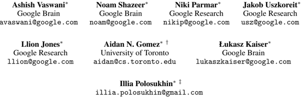
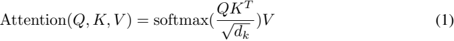
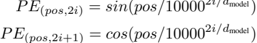
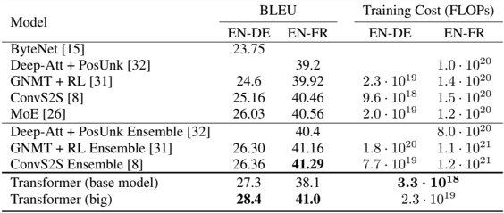

--- PAGE 1 ---

## Attention Is All You Need

The table is an author and affiliation block listing eight contributors to a research paper, with each entry giving the author’s name, institutional affiliation, and email address. Names appear with superscript symbols indicating role notes or footnotes: an asterisk appears next to most names, a dagger symbol appears next to Aidan N. Gomez, and a double-dagger symbol appears next to Illia Polosukhin, signaling different author notes (such as contribution or other footnoted information) even though the meanings are not shown within this snippet.

The authors and their affiliations/emails are: Ashish Vaswani (Google Brain; avaswani@google.com), Noam Shazeer (Google Brain; noam@google.com), Niki Parmar (Google Research; nikip@google.com), Jakob Uszkoreit (Google Research; uszkgoreit@google.com), Llion Jones (Google Research; llion@google.com), Aidan N. Gomez (University of Toronto; aidan@cs.toronto.edu), Lukasz Kaiser (Google Brain; lukaszkaiser@google.com), and Illia Polosukhin (email listed as illia.polosukhin@gmail.com with no institution shown in the entry).

Across affiliations, the dominant organizations are Google Brain and Google Research, with six of eight authors using google.com email addresses. Google Brain is associated with three authors (Vaswani, Shazeer, Kaiser), Google Research with three authors (Parmar, Uszkoreit, Jones), one author is from the University of Toronto (Gomez), and one author uses a personal Gmail address (Polosukhin), making that entry an outlier relative to the otherwise institutional email pattern.

## Abstract

The dominant sequence transduction models are based on complex recurrent or convolutional neural networks that include an encoder and a decoder. The best performing models also connect the encoder and decoder through an attention mechanism. We propose a new simple network architecture, the Transformer, based solely on attention mechanisms, dispensing with recurrence and convolutions entirely. Experiments on two machine translation tasks show these models to be superior in quality while being more parallelizable and requiring significantly less time to train. Our model achieves 28.4 BLEU on the WMT 2014 Englishto-German translation task, improving over the existing best results, including ensembles, by over 2 BLEU. On the WMT 2014 English-to-French translation task, our model establishes a new single-model state-of-the-art BLEU score of 41.0 after training for 3.5 days on eight GPUs, a small fraction of the training costs of the best models from the literature.

## 1 Introduction

Recurrent neural networks, long short-term memory [12] and gated recurrent [7] neural networks in particular, have been firmly established as state of the art approaches in sequence modeling and transduction problems such as language modeling and machine translation [29, 2, 5]. Numerous efforts have since continued to push the boundaries of recurrent language models and encoder-decoder architectures [31, 21, 13].

∗ Equal contribution. Listing order is random. Jakob proposed replacing RNNs with self-attention and started the effort to evaluate this idea. Ashish, with Illia, designed and implemented the first Transformer models and has been crucially involved in every aspect of this work. Noam proposed scaled dot-product attention, multi-head attention and the parameter-free position representation and became the other person involved in nearly every detail. Niki designed, implemented, tuned and evaluated countless model variants in our original codebase and tensor2tensor. Llion also experimented with novel model variants, was responsible for our initial codebase, and efficient inference and visualizations. Lukasz and Aidan spent countless long days designing various parts of and implementing tensor2tensor, replacing our earlier codebase, greatly improving results and massively accelerating our research.

† Work performed while at Google Brain.

‡ Work performed while at Google Research.

--- PAGE 2 ---

Recurrent models typically factor computation along the symbol positions of the input and output sequences. Aligning the positions to steps in computation time, they generate a sequence of hidden states h t , as a function of the previous hidden state h t -1 and the input for position t . This inherently sequential nature precludes parallelization within training examples, which becomes critical at longer sequence lengths, as memory constraints limit batching across examples. Recent work has achieved significant improvements in computational efficiency through factorization tricks [18] and conditional computation [26], while also improving model performance in case of the latter. The fundamental constraint of sequential computation, however, remains.

Attention mechanisms have become an integral part of compelling sequence modeling and transduction models in various tasks, allowing modeling of dependencies without regard to their distance in the input or output sequences [2, 16]. In all but a few cases [22], however, such attention mechanisms are used in conjunction with a recurrent network.

In this work we propose the Transformer, a model architecture eschewing recurrence and instead relying entirely on an attention mechanism to draw global dependencies between input and output. The Transformer allows for significantly more parallelization and can reach a new state of the art in translation quality after being trained for as little as twelve hours on eight P100 GPUs.

## 2 Background

The goal of reducing sequential computation also forms the foundation of the Extended Neural GPU [20], ByteNet [15] and ConvS2S [8], all of which use convolutional neural networks as basic building block, computing hidden representations in parallel for all input and output positions. In these models, the number of operations required to relate signals from two arbitrary input or output positions grows in the distance between positions, linearly for ConvS2S and logarithmically for ByteNet. This makes it more difficult to learn dependencies between distant positions [11]. In the Transformer this is reduced to a constant number of operations, albeit at the cost of reduced effective resolution due to averaging attention-weighted positions, an effect we counteract with Multi-Head Attention as described in section 3.2.

Self-attention, sometimes called intra-attention is an attention mechanism relating different positions of a single sequence in order to compute a representation of the sequence. Self-attention has been used successfully in a variety of tasks including reading comprehension, abstractive summarization, textual entailment and learning task-independent sentence representations [4, 22, 23, 19].

End-to-end memory networks are based on a recurrent attention mechanism instead of sequencealigned recurrence and have been shown to perform well on simple-language question answering and language modeling tasks [28].

To the best of our knowledge, however, the Transformer is the first transduction model relying entirely on self-attention to compute representations of its input and output without using sequencealigned RNNs or convolution. In the following sections, we will describe the Transformer, motivate self-attention and discuss its advantages over models such as [14, 15] and [8].

## 3 Model Architecture

Most competitive neural sequence transduction models have an encoder-decoder structure [5, 2, 29]. Here, the encoder maps an input sequence of symbol representations ( x 1 , ..., x n ) to a sequence of continuous representations z = ( z 1 , ..., z n ) . Given z , the decoder then generates an output sequence ( y 1 , ..., y m ) of symbols one element at a time. At each step the model is auto-regressive [9], consuming the previously generated symbols as additional input when generating the next.

The Transformer follows this overall architecture using stacked self-attention and point-wise, fully connected layers for both the encoder and decoder, shown in the left and right halves of Figure 1, respectively.

## 3.1 Encoder and Decoder Stacks

Encoder: The encoder is composed of a stack of N = 6 identical layers. Each layer has two sub-layers. The first is a multi-head self-attention mechanism, and the second is a simple, position-

--- PAGE 3 ---

Figure 1: The Transformer - model architecture.

The figure is a block diagram of the Transformer sequence-to-sequence architecture with an encoder on the left and a decoder on the right, showing how input tokens are converted into output token probabilities. At the bottom left, “Inputs” flow into an “Input Embedding” block, and a “Positional Encoding” signal is added (shown by a plus sign in a circle) before entering the encoder stack. The encoder is drawn as a repeated module labeled “N×”, meaning the same encoder layer is stacked N times; each encoder layer contains a “Multi-Head Attention” sublayer followed by an “Add & Norm” block (residual connection plus normalization), then a “Feed Forward” sublayer followed by another “Add & Norm” block.

On the bottom right, “Outputs (shifted right)” flow into an “Output Embedding” block, and another “Positional Encoding” is added before entering the decoder stack. The decoder is also repeated “N×” times and each decoder layer contains three main sublayers in order: “Masked Multi-Head Attention” (self-attention with masking to prevent attending to future positions), then “Multi-Head Attention” (attention over the encoder’s output, often called encoder–decoder attention), and then a “Feed Forward” network. Each of these sublayers is wrapped with an “Add & Norm” block, indicating residual connections and normalization around each sublayer. Curved arrows around the attention blocks depict the residual/skip pathways feeding into the “Add & Norm” operations.

At the top of the decoder stack, the final decoder representation goes through a “Linear” layer and then a “Softmax” layer to produce “Output Probabilities,” indicating a probability distribution over the next output token at each position. The overall flow highlights that the encoder processes the entire input sequence into contextual representations, while the decoder generates outputs autoregressively using masked self-attention plus attention to the encoder output.

wise fully connected feed-forward network. We employ a residual connection [10] around each of the two sub-layers, followed by layer normalization [1]. That is, the output of each sub-layer is LayerNorm( x +Sublayer( x )) , where Sublayer( x ) is the function implemented by the sub-layer itself. To facilitate these residual connections, all sub-layers in the model, as well as the embedding layers, produce outputs of dimension d model = 512 .

Decoder: The decoder is also composed of a stack of N = 6 identical layers. In addition to the two sub-layers in each encoder layer, the decoder inserts a third sub-layer, which performs multi-head attention over the output of the encoder stack. Similar to the encoder, we employ residual connections around each of the sub-layers, followed by layer normalization. We also modify the self-attention sub-layer in the decoder stack to prevent positions from attending to subsequent positions. This masking, combined with fact that the output embeddings are offset by one position, ensures that the predictions for position i can depend only on the known outputs at positions less than i .

## 3.2 Attention

An attention function can be described as mapping a query and a set of key-value pairs to an output, where the query, keys, values, and output are all vectors. The output is computed as a weighted sum of the values, where the weight assigned to each value is computed by a compatibility function of the query with the corresponding key.

## 3.2.1 Scaled Dot-Product Attention

We call our particular attention "Scaled Dot-Product Attention" (Figure 2). The input consists of queries and keys of dimension d k , and values of dimension d v . We compute the dot products of the

--- PAGE 4 ---

## Scaled Dot-Product Attention

The figure is a small flow diagram showing the computation steps of an attention mechanism, specifically the scaled dot-product attention path. Three inputs are labeled at the bottom as Q, K, and V (query, key, and value). Q and K feed into a first box labeled “MatMul,” indicating a matrix multiplication between queries and keys. The result flows upward into a box labeled “Scale,” representing scaling of the Q·K product. Above that is a box labeled “Mask (opt.),” indicating an optional masking step applied to the scaled scores. The next box is labeled “SoftMax,” showing that a softmax operation is applied to convert the (optionally masked) scores into attention weights. At the top is a second “MatMul” box, where the softmax weights are multiplied with V to produce the final attention output. The main direction of computation is upward through the stacked boxes, and V is shown feeding into the final MatMul stage on the right.

Figure 2: (left) Scaled Dot-Product Attention. (right) Multi-Head Attention consists of several attention layers running in parallel.

The figure is a block diagram labeled “Multi-Head Attention” that illustrates the standard Transformer multi-head attention module. At the bottom, three separate inputs are shown as vectors labeled V, K, and Q (value, key, and query), each feeding upward into its own “Linear” projection box, indicating that the inputs are first linearly transformed. The outputs of these linear projections are then used to compute multiple parallel attention “heads,” depicted as several stacked, partially overlapped blocks inside a larger shaded container, each block labeled “Scaled Dot-Product Attention.” This indicates that the same scaled dot-product attention operation is performed independently for h different heads using differently projected versions of Q, K, and V. The outputs from all heads are then brought together into a “Concat” block (concatenation), and the concatenated result is passed through a final “Linear” layer at the top to produce the module output. The diagram emphasizes the flow Q/K/V → linear projections → h scaled dot-product attention heads → concatenation → final linear projection, with arrows showing the upward data path throughout.

query with all keys, divide each by √ d k , and apply a softmax function to obtain the weights on the values.

In practice, we compute the attention function on a set of queries simultaneously, packed together into a matrix Q . The keys and values are also packed together into matrices K and V . We compute the matrix of outputs as:

LaTeX: \text{Attention}(Q,K,V)=\text{softmax}\!\left(\frac{QK^{T}}{\sqrt{d_k}}\right)V
This defines the (scaled dot-product) attention operation: it computes similarity scores between queries \(Q\) and keys \(K\) via \(QK^T\), scales them by \(\sqrt{d_k}\), applies a softmax to turn scores into normalized weights, and uses those weights to take a weighted combination of the values \(V\).

The two most commonly used attention functions are additive attention [2], and dot-product (multiplicative) attention. Dot-product attention is identical to our algorithm, except for the scaling factor of 1 √ d k . Additive attention computes the compatibility function using a feed-forward network with a single hidden layer. While the two are similar in theoretical complexity, dot-product attention is much faster and more space-efficient in practice, since it can be implemented using highly optimized matrix multiplication code.

While for small values of d k the two mechanisms perform similarly, additive attention outperforms dot product attention without scaling for larger values of d k [3]. We suspect that for large values of d k , the dot products grow large in magnitude, pushing the softmax function into regions where it has extremely small gradients 4 . To counteract this effect, we scale the dot products by 1 √ d k .

## 3.2.2 Multi-Head Attention

Instead of performing a single attention function with d model-dimensional keys, values and queries, we found it beneficial to linearly project the queries, keys and values h times with different, learned linear projections to d k , d k and d v dimensions, respectively. On each of these projected versions of queries, keys and values we then perform the attention function in parallel, yielding d v -dimensional output values. These are concatenated and once again projected, resulting in the final values, as depicted in Figure 2.

Multi-head attention allows the model to jointly attend to information from different representation subspaces at different positions. With a single attention head, averaging inhibits this.

4 To illustrate why the dot products get large, assume that the components of q and k are independent random variables with mean 0 and variance 1 . Then their dot product, q · k = ∑ d k i =1 q i k i , has mean 0 and variance d k .

--- PAGE 5 ---

LaTeX: \mathrm{MultiHead}(Q,K,V)=\mathrm{Concat}(\mathrm{head}_1,\ldots,\mathrm{head}_h)W^{O}\quad\text{where }\mathrm{head}_i=\mathrm{Attention}(QW_i^{Q},KW_i^{K},VW_i^{V})

This defines multi-head attention: for each head \(i\), an attention operation is applied to linearly projected versions of \(Q\), \(K\), and \(V\) using projection matrices \(W_i^{Q}\), \(W_i^{K}\), and \(W_i^{V}\). The resulting head outputs \(\mathrm{head}_1,\ldots,\mathrm{head}_h\) are concatenated and then multiplied by an output projection matrix \(W^{O}\) to produce the final \(\mathrm{MultiHead}(Q,K,V)\) output.

Where the projections are parameter matrices W Q i ∈ R d model × d k , W i K ∈ R d model × d k , W V i ∈ R d model × d v and W O ∈ R hd v × d model .

In this work we employ h = 8 parallel attention layers, or heads. For each of these we use d k = d v = d model /h = 64 . Due to the reduced dimension of each head, the total computational cost is similar to that of single-head attention with full dimensionality.

## 3.2.3 Applications of Attention in our Model

The Transformer uses multi-head attention in three different ways:

- In "encoder-decoder attention" layers, the queries come from the previous decoder layer, and the memory keys and values come from the output of the encoder. This allows every position in the decoder to attend over all positions in the input sequence. This mimics the typical encoder-decoder attention mechanisms in sequence-to-sequence models such as [31, 2, 8].
- The encoder contains self-attention layers. In a self-attention layer all of the keys, values and queries come from the same place, in this case, the output of the previous layer in the encoder. Each position in the encoder can attend to all positions in the previous layer of the encoder.
- Similarly, self-attention layers in the decoder allow each position in the decoder to attend to all positions in the decoder up to and including that position. We need to prevent leftward information flow in the decoder to preserve the auto-regressive property. We implement this inside of scaled dot-product attention by masking out (setting to -∞ ) all values in the input of the softmax which correspond to illegal connections. See Figure 2.

## 3.3 Position-wise Feed-Forward Networks

In addition to attention sub-layers, each of the layers in our encoder and decoder contains a fully connected feed-forward network, which is applied to each position separately and identically. This consists of two linear transformations with a ReLU activation in between.

LaTeX: \(\mathrm{FFN}(x)=\max(0, xW_{1}+b_{1})\,W_{2}+b_{2}\)

This defines a feed-forward network (FFN) as a two-layer affine transformation with a ReLU nonlinearity: the input \(x\) is first mapped by \(xW_{1}+b_{1}\), passed through \(\max(0,\cdot)\) elementwise, then mapped by \(W_{2}\) and shifted by \(b_{2}\).

While the linear transformations are the same across different positions, they use different parameters from layer to layer. Another way of describing this is as two convolutions with kernel size 1. The dimensionality of input and output is d model = 512 , and the inner-layer has dimensionality d ff = 2048 .

## 3.4 Embeddings and Softmax

Similarly to other sequence transduction models, we use learned embeddings to convert the input tokens and output tokens to vectors of dimension d model. We also use the usual learned linear transformation and softmax function to convert the decoder output to predicted next-token probabilities. In our model, we share the same weight matrix between the two embedding layers and the pre-softmax linear transformation, similar to [24]. In the embedding layers, we multiply those weights by √ d model.

## 3.5 Positional Encoding

Since our model contains no recurrence and no convolution, in order for the model to make use of the order of the sequence, we must inject some information about the relative or absolute position of the tokens in the sequence. To this end, we add "positional encodings" to the input embeddings at the

--- PAGE 6 ---

Table 1: Maximum path lengths, per-layer complexity and minimum number of sequential operations for different layer types. n is the sequence length, d is the representation dimension, k is the kernel size of convolutions and r the size of the neighborhood in restricted self-attention.

The table compares four neural network layer types in terms of computational complexity per layer, how many operations must be performed sequentially (a proxy for parallelizability), and the maximum path length through the layer (a measure related to how many steps information must traverse between positions). The layer types listed are Self-Attention, Recurrent, Convolutional, and Self-Attention (restricted). Complexity is expressed in Big‑O notation using n for sequence length, d for representation/hidden dimensionality, k for convolution kernel width, and r for a restriction factor in restricted attention.

For standard self-attention, the per-layer complexity is O(n^2 · d), reflecting quadratic growth with sequence length, while the number of sequential operations is O(1), indicating the main computations can be parallelized across positions. Its maximum path length is O(1), meaning any position can directly attend to any other in a single step.

For recurrent layers, the per-layer complexity is O(n · d^2), scaling linearly with sequence length but quadratically with dimensionality, and the sequential operations are O(n), since recurrence enforces step-by-step processing along the sequence. The maximum path length is also O(n), indicating long-range dependencies require traversing many sequential steps.

For convolutional layers, the per-layer complexity is O(k · n · d^2), increasing linearly with sequence length and kernel width and quadratically with dimensionality. The sequential operations are O(1), reflecting parallel computation across positions for a given layer. The maximum path length is O(log_k(n)), meaning that with stacked convolutions (or dilations), the number of layers needed for information to propagate across the full sequence grows logarithmically in n with base related to k.

For restricted self-attention, the per-layer complexity is O(r · n · d), which reduces the quadratic dependence on n by limiting attention to a subset of size proportional to r rather than all n positions. Sequential operations remain O(1), and the maximum path length becomes O(n/r), indicating that limiting attention increases the number of steps needed for information to travel across distant positions.

Overall, the table highlights a trade-off: full self-attention provides constant path length and high parallelism but has the highest sequence-length cost (quadratic in n), recurrence has the poorest parallelism and longest paths but avoids n^2 scaling, convolutions balance parallelism with logarithmic path growth, and restricted attention reduces computation relative to full attention at the expense of longer paths proportional to n divided by the attention span.

bottoms of the encoder and decoder stacks. The positional encodings have the same dimension d model as the embeddings, so that the two can be summed. There are many choices of positional encodings, learned and fixed [8].

In this work, we use sine and cosine functions of different frequencies:

LaTeX: \bigcap^{2i/d_{\pi}} 2i/d
The expression shows an intersection symbol with an upper limit/label \(2i/d_{\pi}\), followed by the term \(2i/d\). The subscripts \(\pi\) on \(d_{\pi}\) and the symbols \(i\) and \(d\) appear as parameters in these fractions.

LaTeX: \(PE_{(pos,2i)}=\sin\!\left(\frac{pos}{10000^{2i/d_{model}}}\right),\quad PE_{(pos,2i+1)}=\cos\!\left(\frac{pos}{10000^{2i/d_{model}}}\right)\)

This defines the sinusoidal positional encoding \(PE\) at position \(pos\) across embedding dimensions: even-indexed dimensions \(2i\) use a sine and odd-indexed dimensions \(2i+1\) use a cosine, with the argument scaled by \(10000^{2i/d_{model}}\) where \(d_{model}\) is the model/embedding dimensionality and \(i\) indexes the frequency bands.

where pos is the position and i is the dimension. That is, each dimension of the positional encoding corresponds to a sinusoid. The wavelengths form a geometric progression from 2 π to 10000 · 2 π . We chose this function because we hypothesized it would allow the model to easily learn to attend by relative positions, since for any fixed offset k , PE pos + k can be represented as a linear function of PE pos .

We also experimented with using learned positional embeddings [8] instead, and found that the two versions produced nearly identical results (see Table 3 row (E)). We chose the sinusoidal version because it may allow the model to extrapolate to sequence lengths longer than the ones encountered during training.

## 4 Why Self-Attention

In this section we compare various aspects of self-attention layers to the recurrent and convolutional layers commonly used for mapping one variable-length sequence of symbol representations ( x 1 , ..., x n ) to another sequence of equal length ( z 1 , ..., z n ) , with x i , z i ∈ R d , such as a hidden layer in a typical sequence transduction encoder or decoder. Motivating our use of self-attention we consider three desiderata.

One is the total computational complexity per layer. Another is the amount of computation that can be parallelized, as measured by the minimum number of sequential operations required.

The third is the path length between long-range dependencies in the network. Learning long-range dependencies is a key challenge in many sequence transduction tasks. One key factor affecting the ability to learn such dependencies is the length of the paths forward and backward signals have to traverse in the network. The shorter these paths between any combination of positions in the input and output sequences, the easier it is to learn long-range dependencies [11]. Hence we also compare the maximum path length between any two input and output positions in networks composed of the different layer types.

As noted in Table 1, a self-attention layer connects all positions with a constant number of sequentially executed operations, whereas a recurrent layer requires O ( n ) sequential operations. In terms of computational complexity, self-attention layers are faster than recurrent layers when the sequence length n is smaller than the representation dimensionality d , which is most often the case with sentence representations used by state-of-the-art models in machine translations, such as word-piece [31] and byte-pair [25] representations. To improve computational performance for tasks involving very long sequences, self-attention could be restricted to considering only a neighborhood of size r in

--- PAGE 7 ---

the input sequence centered around the respective output position. This would increase the maximum path length to O ( n/r ) . We plan to investigate this approach further in future work.

A single convolutional layer with kernel width k &lt; n does not connect all pairs of input and output positions. Doing so requires a stack of O ( n/k ) convolutional layers in the case of contiguous kernels, or O ( log k ( n )) in the case of dilated convolutions [15], increasing the length of the longest paths between any two positions in the network. Convolutional layers are generally more expensive than recurrent layers, by a factor of k . Separable convolutions [6], however, decrease the complexity considerably, to O ( k · n · d + n · d 2 ) . Even with k = n , however, the complexity of a separable convolution is equal to the combination of a self-attention layer and a point-wise feed-forward layer, the approach we take in our model.

As side benefit, self-attention could yield more interpretable models. We inspect attention distributions from our models and present and discuss examples in the appendix. Not only do individual attention heads clearly learn to perform different tasks, many appear to exhibit behavior related to the syntactic and semantic structure of the sentences.

## 5 Training

This section describes the training regime for our models.

## 5.1 Training Data and Batching

We trained on the standard WMT 2014 English-German dataset consisting of about 4.5 million sentence pairs. Sentences were encoded using byte-pair encoding [3], which has a shared sourcetarget vocabulary of about 37000 tokens. For English-French, we used the significantly larger WMT 2014 English-French dataset consisting of 36M sentences and split tokens into a 32000 word-piece vocabulary [31]. Sentence pairs were batched together by approximate sequence length. Each training batch contained a set of sentence pairs containing approximately 25000 source tokens and 25000 target tokens.

## 5.2 Hardware and Schedule

We trained our models on one machine with 8 NVIDIA P100 GPUs. For our base models using the hyperparameters described throughout the paper, each training step took about 0.4 seconds. We trained the base models for a total of 100,000 steps or 12 hours. For our big models,(described on the bottom line of table 3), step time was 1.0 seconds. The big models were trained for 300,000 steps (3.5 days).

## 5.3 Optimizer

We used the Adam optimizer [17] with β 1 = 0 . 9 , β 2 = 0 . 98 and glyph[epsilon1] = 10 -9 . We varied the learning rate over the course of training, according to the formula:

LaTeX: \(\mathrm{lrate}=d_{\text{model}}^{-0.5}\cdot \min(\mathrm{step\_num}^{-0.5},\, \mathrm{step\_num}\cdot \mathrm{warmup\_steps}^{-1.5})\)

This defines a learning-rate schedule (\(\mathrm{lrate}\)) that scales with the model dimension \(d_{\text{model}}\) and uses the minimum of two step-dependent terms: one that decays as \(\mathrm{step\_num}^{-0.5}\) and one that increases linearly with \(\mathrm{step\_num}\) while being scaled by \(\mathrm{warmup\_steps}^{-1.5}\).

This corresponds to increasing the learning rate linearly for the first warmup \_ steps training steps, and decreasing it thereafter proportionally to the inverse square root of the step number. We used warmup \_ steps = 4000 .

## 5.4 Regularization

We employ three types of regularization during training:

Residual Dropout We apply dropout [27] to the output of each sub-layer, before it is added to the sub-layer input and normalized. In addition, we apply dropout to the sums of the embeddings and the positional encodings in both the encoder and decoder stacks. For the base model, we use a rate of P drop = 0 . 1 .

--- PAGE 8 ---

Table 2: The Transformer achieves better BLEU scores than previous state-of-the-art models on the English-to-German and English-to-French newstest2014 tests at a fraction of the training cost.

The table compares several neural machine translation models on two English-to-foreign-language tasks, English→German (EN-DE) and English→French (EN-FR), reporting translation quality as BLEU score (higher is better) and the estimated training compute cost measured in floating-point operations (FLOPs). The “Model” column lists architectures and variants, including single models, reinforcement-learning (RL) tuned versions, mixture-of-experts (MoE), and ensembles; bracketed numbers are citation identifiers.

BLEU is given separately for EN-DE and EN-FR. For the pre-Transformer baselines, ByteNet reports only an EN-DE BLEU of 23.75 (no EN-FR listed). Deep-Att + PosUnk reports only EN-FR BLEU of 39.2 (no EN-DE listed). GNMT + RL shows EN-DE 24.6 and EN-FR 39.92. ConvS2S scores EN-DE 25.16 and EN-FR 40.46, while MoE scores EN-DE 26.03 and EN-FR 40.56. Among non-Transformer entries, the best EN-FR BLEU shown is ConvS2S Ensemble at 41.29, and the best EN-DE BLEU shown is 26.36 (ConvS2S Ensemble), narrowly above 26.30 (GNMT + RL Ensemble). Two Deep-Att + PosUnk variants appear: a single model with EN-FR 39.2 and an ensemble with EN-FR 40.4, illustrating an ensemble gain of about +1.2 BLEU on EN-FR where both are provided.

Training cost is also split by task (EN-DE FLOPs and EN-FR FLOPs). Costs span roughly from 3.3×10^18 FLOPs at the low end (Transformer base on EN-DE) up to about 1.2×10^21 FLOPs at the high end (ConvS2S Ensemble on EN-FR). Several older or ensemble models show very high compute: for example, GNMT + RL is 2.3×10^19 (EN-DE) and 1.4×10^20 (EN-FR), while the GNMT + RL Ensemble rises to 1.8×10^20 (EN-DE) and 1.1×10^21 (EN-FR). ConvS2S is 9.6×10^18 (EN-DE) and 1.5×10^20 (EN-FR), whereas ConvS2S Ensemble increases to 7.7×10^19 (EN-DE) and 1.2×10^21 (EN-FR). Deep-Att + PosUnk lists only EN-FR training cost of 1.0×10^20, and its ensemble lists only EN-FR training cost of 8.0×10^20. MoE is 2.0×10^19 (EN-DE) and 1.2×10^20 (EN-FR). A consistent pattern where both are reported is that EN-FR training cost is much larger than EN-DE for the same model, often by roughly an order of magnitude (for example, Transformer big is 2.3×10^19 FLOPs on EN-DE).

The bottom section highlights Transformer results. The Transformer (base model) achieves EN-DE BLEU 27.3 and EN-FR BLEU 38.1 with an EN-DE training cost of 3.3×10^18 FLOPs (no EN-FR FLOPs shown for this row). Transformer (big) achieves the highest EN-DE BLEU in the table at 28.4 and a high EN-FR BLEU of 41.0, with an EN-DE training cost of 2.3×10^19 FLOPs. Relative to the strongest non-Transformer EN-DE results (around 26.3–26.4 BLEU), Transformer big is about +2 BLEU while using substantially less EN-DE compute than the large ensembles (10^19 vs ~10^20 FLOPs). On EN-FR, Transformer big at 41.0 is close to the best listed ensemble score of 41.29, but without the extremely high EN-FR training costs reported for those ensembles (though EN-FR FLOPs for Transformer big are not provided here).

Label Smoothing During training, we employed label smoothing of value glyph[epsilon1] ls = 0 . 1 [30]. This hurts perplexity, as the model learns to be more unsure, but improves accuracy and BLEU score.

## 6 Results

## 6.1 Machine Translation

On the WMT 2014 English-to-German translation task, the big transformer model (Transformer (big) in Table 2) outperforms the best previously reported models (including ensembles) by more than 2 . 0 BLEU, establishing a new state-of-the-art BLEU score of 28 . 4 . The configuration of this model is listed in the bottom line of Table 3. Training took 3 . 5 days on 8 P100 GPUs. Even our base model surpasses all previously published models and ensembles, at a fraction of the training cost of any of the competitive models.

On the WMT 2014 English-to-French translation task, our big model achieves a BLEU score of 41 . 0 , outperforming all of the previously published single models, at less than 1 / 4 the training cost of the previous state-of-the-art model. The Transformer (big) model trained for English-to-French used dropout rate P drop = 0 . 1 , instead of 0 . 3 .

For the base models, we used a single model obtained by averaging the last 5 checkpoints, which were written at 10-minute intervals. For the big models, we averaged the last 20 checkpoints. We used beam search with a beam size of 4 and length penalty α = 0 . 6 [31]. These hyperparameters were chosen after experimentation on the development set. We set the maximum output length during inference to input length + 50 , but terminate early when possible [31].

Table 2 summarizes our results and compares our translation quality and training costs to other model architectures from the literature. We estimate the number of floating point operations used to train a model by multiplying the training time, the number of GPUs used, and an estimate of the sustained single-precision floating-point capacity of each GPU 5 .

## 6.2 Model Variations

To evaluate the importance of different components of the Transformer, we varied our base model in different ways, measuring the change in performance on English-to-German translation on the development set, newstest2013. We used beam search as described in the previous section, but no checkpoint averaging. We present these results in Table 3.

In Table 3 rows (A), we vary the number of attention heads and the attention key and value dimensions, keeping the amount of computation constant, as described in Section 3.2.2. While single-head attention is 0.9 BLEU worse than the best setting, quality also drops off with too many heads.

5 We used values of 2.8, 3.7, 6.0 and 9.5 TFLOPS for K80, K40, M40 and P100, respectively.

--- PAGE 9 ---

Table 3: Variations on the Transformer architecture. Unlisted values are identical to those of the base model. All metrics are on the English-to-German translation development set, newstest2013. Listed perplexities are per-wordpiece, according to our byte-pair encoding, and should not be compared to per-word perplexities.

The table reports an ablation study of a Transformer-style sequence-to-sequence model, showing how architectural and regularization hyperparameters affect validation perplexity (PPL, dev), validation BLEU (BLEU, dev), and model size (params, in millions). Each row is a model variant trained for a specified number of training steps, with the “base” configuration used as the main reference point.

The left side lists hyperparameters: N is the number of layers (for the encoder and decoder stack as used in the reference implementation), d_model is the model/embedding width, d_ff is the inner width of the feed-forward sublayer, h is the number of attention heads, and d_k and d_v are the per-head key and value dimensions (so the total attention projection sizes relate to h × d_k and h × d_v). P_drop is dropout probability, and ε_ls is label-smoothing strength. “train steps” indicates the training schedule length. On the right, PPL (dev) is lower-is-better, BLEU (dev) is higher-is-better, and “params ×10^6” is the approximate parameter count in millions.

The base model uses N=6, d_model=512, d_ff=2048, h=8, d_k=64, d_v=64, dropout P_drop=0.1, label smoothing ε_ls=0.1, and is trained for 100K steps. This base achieves dev PPL 4.92 and dev BLEU 25.8 with about 65M parameters. Across the table, typical dev PPL values range roughly from about 4.3 to above 6, while dev BLEU spans roughly from the low 20s up to about 26.4, with parameter counts ranging from a few tens of millions up to over 200M.

Block (A) varies the number of heads h while holding the overall model width fixed (d_model=512 and d_ff=2048 are implied from the base), which forces d_k and d_v to change accordingly. The tested settings include h=1 with very large per-head dimensions (d_k=d_v=512), h=4 (128/128), h=16 (32/32), and h=32 (16/16). Performance is best around the base-like multi-head regime: h=16 reaches dev PPL 4.91 and BLEU 25.8 (essentially matching the base), while extreme choices are worse. A single head (h=1) degrades to PPL 5.29 and BLEU 24.9, and very many small heads (h=32) gives PPL 5.01 and BLEU 25.4. This suggests an intermediate-to-high head count with reasonable per-head dimensionality is beneficial, and that collapsing to one head is clearly harmful.

Block (B) changes only the per-head key/value dimensions while keeping the head count and other base settings otherwise aligned; it reports two cases with d_k=d_v=16 and d_k=d_v=32. Reducing per-head dimension to 16 hurts (PPL 5.16, BLEU 25.1) compared with using 32 (PPL 5.01, BLEU 25.4). Parameter counts for these variants are slightly smaller than base, around 58–60M, indicating modest savings with some quality loss.

Block (C) explores depth and width trade-offs and their effect on quality and parameter count. Varying the number of layers N shows that shallower models are much worse: N=2 yields PPL 6.11 and BLEU 23.7 with only ~36M parameters, while N=4 improves to PPL 5.19 and BLEU 25.3 (~50M). Increasing depth beyond the base can help: N=8 reaches PPL 4.88 and BLEU 25.5 (~80M), slightly better PPL than base with similar BLEU. The same block also varies d_model and d_ff (and corresponding attention dimensions, shown as d_k=d_v values such as 32/32 or 128/128). A smaller model with d_model=256 performs worse (PPL 5.75, BLEU 24.5) but is compact (~28M parameters). Increasing to d_model=1024 improves substantially (PPL 4.66, BLEU 26.0) but increases size a lot (~168M). Increasing the feed-forward width also shows gains: d_ff=1024 gives PPL 5.12 and BLEU 25.4 (~53M), while d_ff=4096 improves to PPL 4.75 and BLEU 26.2 (~90M). Overall, scaling up d_model and d_ff tends to reduce perplexity and raise BLEU, with expected parameter growth; the strongest BLEU within these mid-scale variants comes from larger d_model and especially larger d_ff.

Block (D) varies regularization: dropout P_drop is tested at 0.0 and 0.2 (with other settings base-like), and label smoothing ε_ls is also tested at 0.0 and 0.2. Removing dropout (P_drop=0.0) is clearly harmful (PPL 5.77, BLEU 24.6). Increasing dropout to 0.2 is close to base quality (PPL 4.95, BLEU 25.5). Removing label smoothing (ε_ls=0.0) yields PPL 4.67 and BLEU 25.3, while increasing label smoothing to 0.2 produces PPL 5.47 and BLEU 25.7. In this set, label smoothing affects PPL and BLEU differently: ε_ls=0.0 gives better PPL but slightly lower BLEU than base, whereas ε_ls=0.2 worsens PPL but keeps BLEU competitive; the clearest negative result is overly high label smoothing harming perplexity.

Block (E) notes a change in the positional encoding approach: “positional embedding instead of sinusoids.” With that substitution, the model attains PPL 4.92 and BLEU 25.7, essentially matching the base, indicating little sensitivity between these two positional encoding choices under these settings.

The final “big” model scales up capacity and training: it uses N=6, d_model=1024, d_ff=4096, h=16, dropout P_drop=0.3, trains for 300K steps, and has ~213M parameters. It achieves the best reported development metrics in the table, with dev PPL 4.33 and dev BLEU 26.4, showing that larger width/FFN size plus longer training and stronger dropout yields the strongest overall performance among the compared configurations.

In Table 3 rows (B), we observe that reducing the attention key size d k hurts model quality. This suggests that determining compatibility is not easy and that a more sophisticated compatibility function than dot product may be beneficial. We further observe in rows (C) and (D) that, as expected, bigger models are better, and dropout is very helpful in avoiding over-fitting. In row (E) we replace our sinusoidal positional encoding with learned positional embeddings [8], and observe nearly identical results to the base model.

## 7 Conclusion

In this work, we presented the Transformer, the first sequence transduction model based entirely on attention, replacing the recurrent layers most commonly used in encoder-decoder architectures with multi-headed self-attention.

For translation tasks, the Transformer can be trained significantly faster than architectures based on recurrent or convolutional layers. On both WMT 2014 English-to-German and WMT 2014 English-to-French translation tasks, we achieve a new state of the art. In the former task our best model outperforms even all previously reported ensembles.

We are excited about the future of attention-based models and plan to apply them to other tasks. We plan to extend the Transformer to problems involving input and output modalities other than text and to investigate local, restricted attention mechanisms to efficiently handle large inputs and outputs such as images, audio and video. Making generation less sequential is another research goals of ours.

The code we used to train and evaluate our models is available at https://github.com/ tensorflow/tensor2tensor .

Acknowledgements We are grateful to Nal Kalchbrenner and Stephan Gouws for their fruitful comments, corrections and inspiration.

--- PAGE 10 ---

## References

- [1] Jimmy Lei Ba, Jamie Ryan Kiros, and Geoffrey E Hinton. Layer normalization. arXiv preprint arXiv:1607.06450 , 2016.
- [2] Dzmitry Bahdanau, Kyunghyun Cho, and Yoshua Bengio. Neural machine translation by jointly learning to align and translate. CoRR , abs/1409.0473, 2014.
- [3] Denny Britz, Anna Goldie, Minh-Thang Luong, and Quoc V. Le. Massive exploration of neural machine translation architectures. CoRR , abs/1703.03906, 2017.
- [4] Jianpeng Cheng, Li Dong, and Mirella Lapata. Long short-term memory-networks for machine reading. arXiv preprint arXiv:1601.06733 , 2016.
- [5] Kyunghyun Cho, Bart van Merrienboer, Caglar Gulcehre, Fethi Bougares, Holger Schwenk, and Yoshua Bengio. Learning phrase representations using rnn encoder-decoder for statistical machine translation. CoRR , abs/1406.1078, 2014.
- [6] Francois Chollet. Xception: Deep learning with depthwise separable convolutions. arXiv preprint arXiv:1610.02357 , 2016.
- [7] Junyoung Chung, Çaglar Gülçehre, Kyunghyun Cho, and Yoshua Bengio. Empirical evaluation of gated recurrent neural networks on sequence modeling. CoRR , abs/1412.3555, 2014.
- [8] Jonas Gehring, Michael Auli, David Grangier, Denis Yarats, and Yann N. Dauphin. Convolutional sequence to sequence learning. arXiv preprint arXiv:1705.03122v2 , 2017.
- [9] Alex Graves. Generating sequences with recurrent neural networks. arXiv preprint arXiv:1308.0850 , 2013.
- [10] Kaiming He, Xiangyu Zhang, Shaoqing Ren, and Jian Sun. Deep residual learning for image recognition. In Proceedings of the IEEE Conference on Computer Vision and Pattern Recognition , pages 770-778, 2016.
- [11] Sepp Hochreiter, Yoshua Bengio, Paolo Frasconi, and Jürgen Schmidhuber. Gradient flow in recurrent nets: the difficulty of learning long-term dependencies, 2001.
- [12] Sepp Hochreiter and Jürgen Schmidhuber. Long short-term memory. Neural computation , 9(8):1735-1780, 1997.
- [13] Rafal Jozefowicz, Oriol Vinyals, Mike Schuster, Noam Shazeer, and Yonghui Wu. Exploring the limits of language modeling. arXiv preprint arXiv:1602.02410 , 2016.
- [14] Łukasz Kaiser and Ilya Sutskever. Neural GPUs learn algorithms. In International Conference on Learning Representations (ICLR) , 2016.
- [15] Nal Kalchbrenner, Lasse Espeholt, Karen Simonyan, Aaron van den Oord, Alex Graves, and Koray Kavukcuoglu. Neural machine translation in linear time. arXiv preprint arXiv:1610.10099v2 , 2017.
- [16] Yoon Kim, Carl Denton, Luong Hoang, and Alexander M. Rush. Structured attention networks. In International Conference on Learning Representations , 2017.
- [17] Diederik Kingma and Jimmy Ba. Adam: A method for stochastic optimization. In ICLR , 2015.
- [18] Oleksii Kuchaiev and Boris Ginsburg. Factorization tricks for LSTM networks. arXiv preprint arXiv:1703.10722 , 2017.
- [19] Zhouhan Lin, Minwei Feng, Cicero Nogueira dos Santos, Mo Yu, Bing Xiang, Bowen Zhou, and Yoshua Bengio. A structured self-attentive sentence embedding. arXiv preprint arXiv:1703.03130 , 2017.
- [20] Samy Bengio Łukasz Kaiser. Can active memory replace attention? In Advances in Neural Information Processing Systems, (NIPS) , 2016.

--- PAGE 11 ---

- [21] Minh-Thang Luong, Hieu Pham, and Christopher D Manning. Effective approaches to attentionbased neural machine translation. arXiv preprint arXiv:1508.04025 , 2015.
- [22] Ankur Parikh, Oscar Täckström, Dipanjan Das, and Jakob Uszkoreit. A decomposable attention model. In Empirical Methods in Natural Language Processing , 2016.
- [23] Romain Paulus, Caiming Xiong, and Richard Socher. A deep reinforced model for abstractive summarization. arXiv preprint arXiv:1705.04304 , 2017.
- [24] Ofir Press and Lior Wolf. Using the output embedding to improve language models. arXiv preprint arXiv:1608.05859 , 2016.
- [25] Rico Sennrich, Barry Haddow, and Alexandra Birch. Neural machine translation of rare words with subword units. arXiv preprint arXiv:1508.07909 , 2015.
- [26] Noam Shazeer, Azalia Mirhoseini, Krzysztof Maziarz, Andy Davis, Quoc Le, Geoffrey Hinton, and Jeff Dean. Outrageously large neural networks: The sparsely-gated mixture-of-experts layer. arXiv preprint arXiv:1701.06538 , 2017.
- [27] Nitish Srivastava, Geoffrey E Hinton, Alex Krizhevsky, Ilya Sutskever, and Ruslan Salakhutdinov. Dropout: a simple way to prevent neural networks from overfitting. Journal of Machine Learning Research , 15(1):1929-1958, 2014.
- [28] Sainbayar Sukhbaatar, arthur szlam, Jason Weston, and Rob Fergus. End-to-end memory networks. In C. Cortes, N. D. Lawrence, D. D. Lee, M. Sugiyama, and R. Garnett, editors, Advances in Neural Information Processing Systems 28 , pages 2440-2448. Curran Associates, Inc., 2015.
- [29] Ilya Sutskever, Oriol Vinyals, and Quoc VV Le. Sequence to sequence learning with neural networks. In Advances in Neural Information Processing Systems , pages 3104-3112, 2014.
- [30] Christian Szegedy, Vincent Vanhoucke, Sergey Ioffe, Jonathon Shlens, and Zbigniew Wojna. Rethinking the inception architecture for computer vision. CoRR , abs/1512.00567, 2015.
- [31] Yonghui Wu, Mike Schuster, Zhifeng Chen, Quoc V Le, Mohammad Norouzi, Wolfgang Macherey, Maxim Krikun, Yuan Cao, Qin Gao, Klaus Macherey, et al. Google's neural machine translation system: Bridging the gap between human and machine translation. arXiv preprint arXiv:1609.08144 , 2016.
- [32] Jie Zhou, Ying Cao, Xuguang Wang, Peng Li, and Wei Xu. Deep recurrent models with fast-forward connections for neural machine translation. CoRR , abs/1606.04199, 2016.
